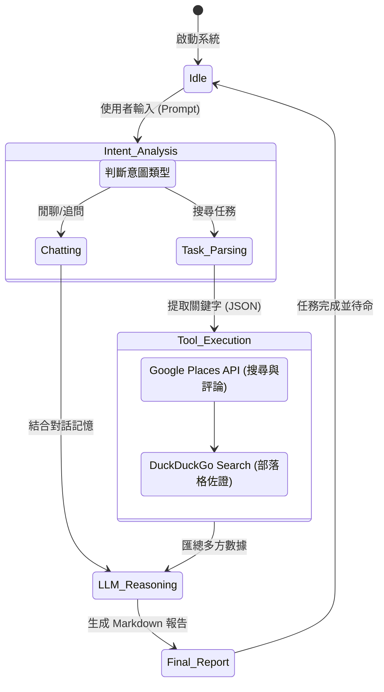

# ☕ CAFÉ Finder: 跑咖找找

**CAFÉ Finder** 是一個基於 Large Language Model (LLM) 開發的智慧 Agent，專門為咖啡愛好者設計 。不同於傳統搜尋引擎，它結合了 **Google Places API** 的即時評論分析與 **網路搜尋** 的食記佐證，能精準理解模糊需求（如：適合讀書、有好吃巴斯克蛋糕），並提供具備推理依據的深度推薦報告 。

本專案為 **TOC 2025 Final Project** 之實作成果 。

## 🌟 核心特色 (Advanced Level 功能)

為了超越基礎的 Web Search 範例，本專案實作了以下功能 ：

* **智慧意圖路由 (Intent Router)**：能自動判斷使用者是在「打招呼/閒聊」、「追問細節」或「發起新的搜尋任務」，避免無謂的 API 消耗。
* **雙階段數據檢索 (RAG)**：
* **第一階段**：透過 Google Places API 獲取店家基本資訊與真實用戶評論 。
* **第二階段**：自動執行網路搜尋，抓取外部部落格與網誌資訊作為第三方佐證 。
* **多維度證據比對**：LLM 會閱讀抓取到的評論與食記，交叉驗證該店家是否真的符合使用者的特殊需求（如：插座數量、限時規定、特定甜點評價）。
* **專業 Web UI**：使用 Streamlit 打造現代化對話介面，並能即時顯示 Agent 的思考路徑與行動狀態 。
---

## 🏗️ 系統架構與邏輯 (System Logic)

本系統的核心邏輯遵循下方的 **狀態機 (State Machine)** 設計，確保任務執行的嚴謹性 ：



---

## 🛠️ 技術亮點 (Tech Stack)

* **大腦 (LLM)**: 使用助教提供的 **Ollama API** (模型: gpt-oss-120b) 。
* **介面 (UI)**: Streamlit (Python-based Web Framework)。
* **地圖數據**: Google Places API (Text Search & Place Details)。
* **網路檢索**: DuckDuckGo Search API。
* **程式語言**: Python 3.10+ 。

---

## 🚀 快速開始 (Getting Started)

### 1. 安裝環境

建議使用 Conda 建立虛擬環境：

```bash
conda create -n cafefinder python=3.10 -y
conda activate cafefinder
pip install -r requirements.txt

```

### 2. 配置 API 金鑰

請在主目錄下建立 `config.py`：

```python
# config.py
OLLAMA_API_KEY = "Your_Ollama_Key"
OLLAMA_API_URL = "https://api-gateway.netdb.csie.ncku.edu.tw/api/generate" #助教提供
GOOGLE_MAPS_API_KEY = "Your_Google_Key"

```

### 3. 啟動網頁介面

```bash
streamlit run app.py

```

---

## 📂 檔案結構 (File Structure)

* `app.py`: 網頁介面邏輯。
* `main.py`: Agent 核心決策與意圖路由邏輯。
* `config.py`: 存放 API 金鑰 (本地使用)。
* `requirements.txt`: 專案套件依賴清單。
* `src/`:
    * `llm_api.py`: 封裝具備 Bearer Token 認證的 Ollama API 呼叫 。
    * `gmaps_tool.py`: 負責地圖搜尋與評論檢索工具。
    * `web_search_tool.py`: 負責自動化網頁內容檢索工具 。
* `diagrams/`: 存放系統架構圖與狀態機圖 。

---
## ⚖️ 免責聲明與安全性

* 本專案僅供學術用途。
---
